Nama: Imam Muzakki

NIM: H1D022060

Shift Baru: D

# Responsi 1

## Daftar Isi
1. [Proses Registrasi](#proses-registrasi)
2. [Proses Login](#proses-login)
3. [Menampilkan Daftar Produk](#menampilkan-daftar-produk)
4. [Melihat Detail Produk](#melihat-detail-produk)
5. [Menambah Produk Baru](#menambah-produk-baru)
6. [Mengubah Produk](#mengubah-produk)
7. [Menghapus Produk](#menghapus-produk)
8. [Proses Logout](#proses-logout)

## Proses Registrasi

### a. Mengisi Form Registrasi

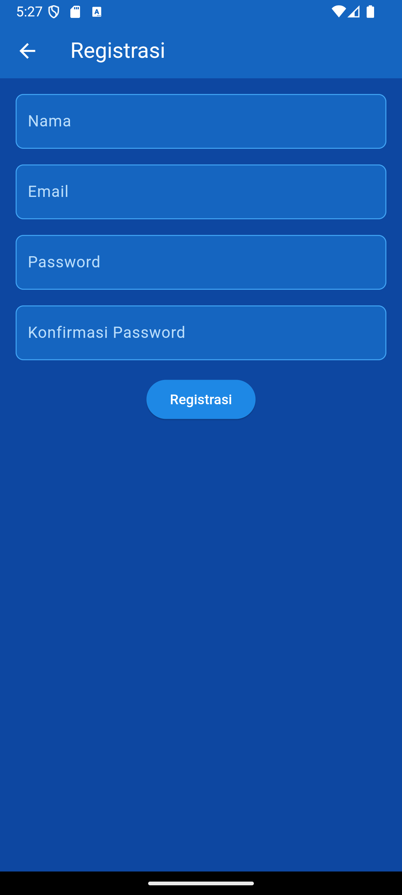

Pengguna diminta untuk mengisi nama, email, password, dan konfirmasi password.

Kode terkait:

```dart
Widget _namaTextField() {
  return TextFormField(
    decoration: const InputDecoration(labelText: "Nama"),
    keyboardType: TextInputType.text,
    controller: _namaTextboxController,
    validator: (value) {
      if (value!.length < 3) {
        return "Nama harus diisi minimal 3 karakter";
      }
      return null;
    },
  );
}

// ... (kode untuk email, password, dan konfirmasi password)!
```

### b. Proses Pengiriman Data Registrasi


Setelah menekan tombol registrasi, aplikasi akan mengirim data ke API.

Kode terkait:

```dart
void _submit() {
    _formKey.currentState!.save();
    setState(() {
      _isLoading = true;
    });
    RegistrasiBloc.registrasi(
      nama: _namaTextboxController.text,
      email: _emailTextboxController.text,
      password: _passwordTextboxController.text,
    ).then((value) {
      if (value['status']) {
        showDialog(
          context: context,
          barrierDismissible: false,
          builder: (BuildContext context) => SuccessDialog(
            description: "Registrasi berhasil, silahkan login",
            okClick: () {
              Navigator.pop(context);
            },
          ),
        );
      } else {
        showDialog(
          context: context,
          barrierDismissible: false,
          builder: (BuildContext context) => WarningDialog(
            description: value['message'],
          ),
        );
      }
    }).catchError((error) {
      showDialog(
        context: context,
        barrierDismissible: false,
        builder: (BuildContext context) => const WarningDialog(
          description: "Registrasi gagal, silahkan coba lagi",
        ),
      );
    }).whenComplete(() {
      setState(() {
        _isLoading = false;
      });
    });
  }
```

### c. Hasil Registrasi


Pengguna akan melihat popup yang menginformasikan hasil registrasi.

## Proses Login

### a. Mengisi Form Login

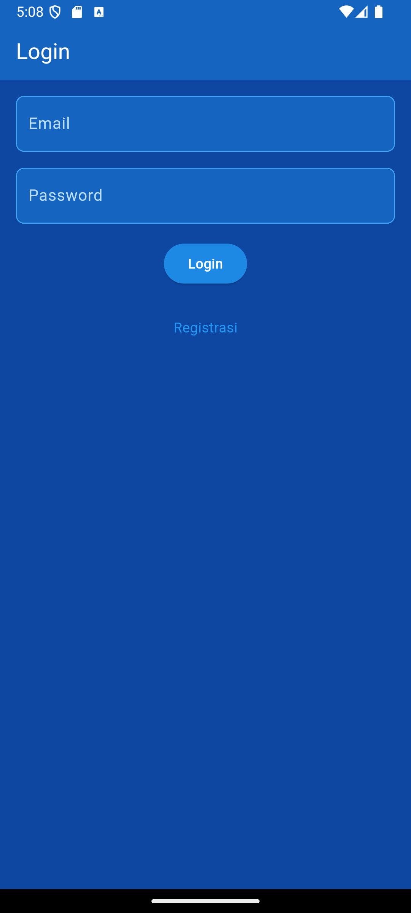

Pengguna diminta untuk memasukkan email dan password pada form login.

Kode terkait:

```dart
Widget _emailTextField() {
  return TextFormField(
    decoration: const InputDecoration(labelText: "Email"),
    keyboardType: TextInputType.emailAddress,
    controller: _emailTextboxController,
    validator: (value) {
      if (value!.isEmpty) {
        return 'Email harus diisi';
      }
      return null;
    },
  );
}

Widget _passwordTextField() {
  return TextFormField(
    decoration: const InputDecoration(labelText: "Password"),
    keyboardType: TextInputType.text,
    obscureText: true,
    controller: _passwordTextboxController,
    validator: (value) {
      if (value!.isEmpty) {
        return "Password harus diisi";
      }
      return null;
    },
  );
}
```

### b. Proses Autentikasi

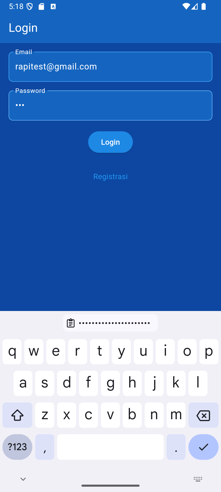

Setelah menekan tombol login, aplikasi akan mengirim permintaan ke API untuk melakukan autentikasi.

Kode terkait:

```dart
void _submit() {
  _formKey.currentState!.save();
  setState(() {
    _isLoading = true;
  });

  LoginBloc.login(
      email: _emailTextboxController.text,
      password: _passwordTextboxController.text)
      .then((value) async {
    if (value.code == 200) {
      await UserInfo().setToken(value.token ?? "");
      await UserInfo().setUserID(int.tryParse(value.userID.toString()) ?? 0);

      showDialog(
        context: context,
        barrierDismissible: false,
        builder: (BuildContext context) => SuccessDialog(
          description: "Login berhasil",
          okClick: () {
            Navigator.pushReplacement(
              context,
              MaterialPageRoute(
                builder: (context) => const ProdukPage(),
              ),
            );
          },
        ),
      );
    } else {
      showDialog(
          context: context,
          barrierDismissible: false,
          builder: (BuildContext context) => const WarningDialog(
            description: "Login gagal(?), silahkan coba lagi",
          ));
    }
  }, onError: (error) {
    print(error);
    showDialog(
        context: context,
        barrierDismissible: false,
        builder: (BuildContext context) => const WarningDialog(
          description: "Login gagal(!), silahkan coba lagi",
        ));
  });

  setState(() {
    _isLoading = false;
  });
}
```

### c. Hasil Login


Setelah proses autentikasi, pengguna akan melihat popup yang menginformasikan hasil login.

## Menampilkan Daftar Produk

### a. Halaman Utama Produk


Setelah login berhasil, pengguna akan diarahkan ke halaman utama yang menampilkan daftar terjemahan.

Kode terkait:

```dart
class _ProdukPageState extends State<ProdukPage> {
  @override
  Widget build(BuildContext context) {
    return Scaffold(
      appBar: AppBar(
        title: const Text('List Terjemahan'),
        actions: [
          Padding(
              padding: const EdgeInsets.only(right: 20.0),
              child: GestureDetector(
                child: const Icon(Icons.add, size: 26.0),
                onTap: () async {
                  Navigator.push(context,
                      MaterialPageRoute(builder: (context) => ProdukForm()));
                },
              ))
        ],
      ),
      body: FutureBuilder<List>(
        future: ProdukBloc.getProduks(),
        builder: (context, snapshot) {
          if (snapshot.hasError) print(snapshot.error);
          return snapshot.hasData
              ? ListProduk(
            list: snapshot.data,
          )
              : const Center(
            child: CircularProgressIndicator(),
          );
        },
      ),
    );
  }
}
```

### b. Proses Pengambilan Data Produk

Data terjemahan diambil dari API menggunakan `ProdukBloc.getProduks()`.

Kode terkait:

```dart
class ProdukBloc {
  static Future<List<Produk>> getProduks() async {
    String apiUrl = ApiUrl.listProduk;
    var response = await Api().get(apiUrl);
    var jsonObj = json.decode(response.body);
    List<dynamic> listProduk = (jsonObj as Map<String, dynamic>)['data'];
    List<Produk> produks = [];
    for (int i = 0; i < listProduk.length; i++) {
      produks.add(Produk.fromJson(listProduk[i]));
    }
    return produks;
  }
}
```

## Melihat Detail Terjemahan

### a. Memilih Terjemahan dari Daftar

Pengguna dapat melihat detail terjemahan dengan menekan item terjemahan di daftar.

### b. Halaman Detail Terjemahan

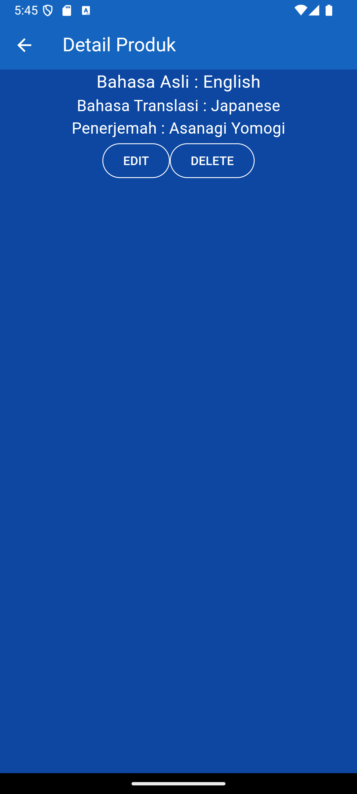

Halaman ini menampilkan informasi lengkap tentang terjemahan yang dipilih.

Kode terkait:

```dart
class _ProdukDetailState extends State<ProdukDetail> {
  @override
  Widget build(BuildContext context) {
    return Scaffold(
      appBar: AppBar(
        title: const Text('Detail Produk'),
      ),
      body: Center(
        child: Column(
          children: [
            Text(
              "Bahasa Asli : ${widget.produk!.original_language}",
              style: const TextStyle(fontSize: 20.0),
            ),
            Text(
              "Bahasa Translasi : ${widget.produk!.translated_language}",
              style: const TextStyle(fontSize: 18.0),
            ),
            Text(
              "Penerjemah : ${widget.produk!.translator_name}",
              style: const TextStyle(fontSize: 18.0),
            ),
            _tombolHapusEdit()
          ],
        ),
      ),
    );
  }
}
```

## Menambah Terjemahan Baru

### a. Membuka Form Tambah Terjemahan

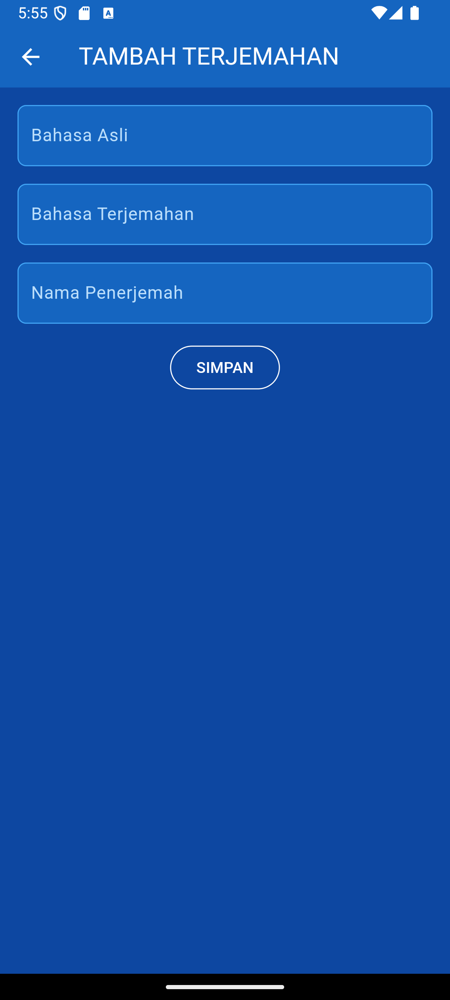

Pengguna dapat menambah terjemahan baru dengan menekan ikon "+" di halaman utama.

### b. Mengisi Data Terjemahan Baru

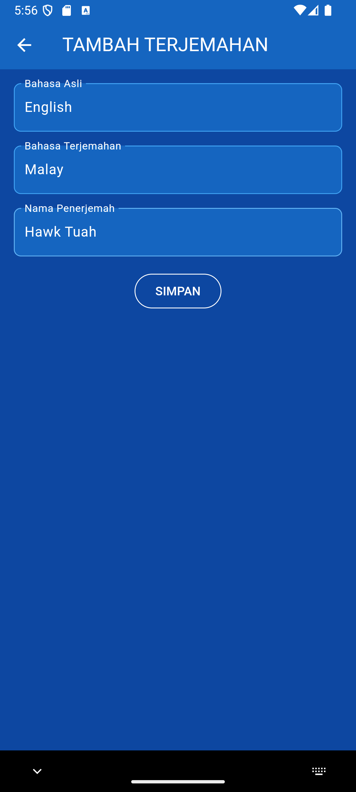

Pengguna diminta untuk mengisi kode produk, nama produk, dan harga produk.

Kode terkait:

```dart
Widget _kodeProdukTextField() {
  return TextFormField(
    decoration: const InputDecoration(labelText: "Bahasa Asli"),
    keyboardType: TextInputType.text,
    controller: _originalLanguageTextboxController,
    validator: (value) {
      if (value!.isEmpty) {
        return "Bahasa Asli harus diisi";
      }
      return null;
    },
  );
}

// ... (kode untuk bahasa terjemahan dan nama penerjemah)
```

### c. Proses Penyimpanan Produk Baru

Setelah menekan tombol simpan, aplikasi akan mengirim data ke API.

Kode terkait:

```dart
simpan() {
  setState(() {
    _isLoading = true;
  });
  Produk createProduk = Produk(id: null);
  createProduk.original_language = _originalLanguageTextboxController.text;
  createProduk.translated_language = _translatedLanguageTextboxController.text;
  createProduk.translator_name = _translatorNameTextboxController.text;
  ProdukBloc.addProduk(produk: createProduk).then((value) {
    if (value['status']) {
      showDialog(
        context: context,
        barrierDismissible: false,
        builder: (BuildContext context) => SuccessDialog(
          description: "Terjemahan berhasil ditambahkan",
          okClick: () {
            Navigator.of(context).pushReplacement(
              MaterialPageRoute(
                builder: (BuildContext context) => const ProdukPage(),
              ),
            );
          },
        ),
      );
    } else {
      showDialog(
        context: context,
        builder: (BuildContext context) => WarningDialog(
          description: value['message'],
        ),
      );
    }
  }).catchError((error) {
    showDialog(
      context: context,
      builder: (BuildContext context) => const WarningDialog(
        description: "Simpan gagal, silahkan coba lagi",
      ),
    );
  }).whenComplete(() {
    setState(() {
      _isLoading = false;
    });
  });
}
```

### d. Hasil Penambahan Terjemahan

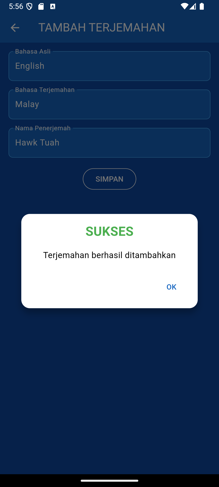

Pengguna akan melihat popup yang menginformasikan hasil penambahan terjemahan.

## Mengubah Terjemahan

### a. Membuka Form Ubah Terjemahan

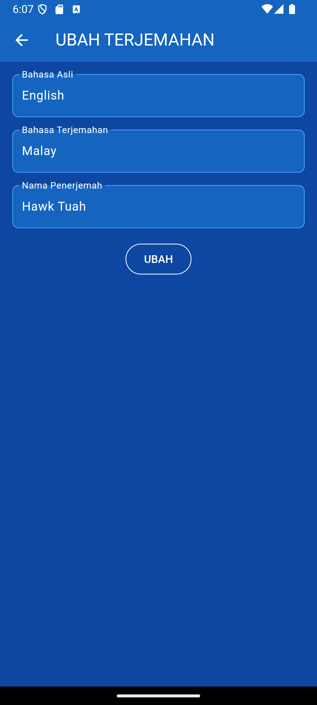

Dari halaman detail terjemahan, pengguna dapat menekan tombol "EDIT" untuk membuka form ubah terjemahan.

### b. Mengisi Perubahan Data Terjemahan

Form ubah produk akan terisi dengan data terjemahan yang ada, dan pengguna dapat mengubahnya.

### c. Proses Penyimpanan Perubahan


Setelah menekan tombol ubah, aplikasi akan mengirim data perubahan ke API.

Kode terkait:

```dart
ubah() {
  setState(() {
    _isLoading = true;
  });
  Produk updateProduk = Produk(id: widget.produk!.id!);
  updateProduk.original_language = _originalLanguageTextboxController.text;
  updateProduk.translated_language = _translatedLanguageTextboxController.text;
  updateProduk.translator_name = _translatorNameTextboxController.text;
  ProdukBloc.updateProduk(produk: updateProduk).then((value) {
    showDialog(
      context: context,
      barrierDismissible: false,
      builder: (BuildContext context) => SuccessDialog(
        description: "Terjemahan berhasil diubah",
        okClick: () {
          Navigator.of(context).push(
            MaterialPageRoute(
              builder: (BuildContext context) => const ProdukPage(),
            ),
          );
        },
      ),
    );
  }, onError: (error) {
    showDialog(
        context: context,
        builder: (BuildContext context) => const WarningDialog(
          description: "Permintaan ubah data gagal, silahkan coba lagi",
        ));
  });
  setState(() {
    _isLoading = false;
  });
}
```

### d. Hasil Perubahan Terjemahan

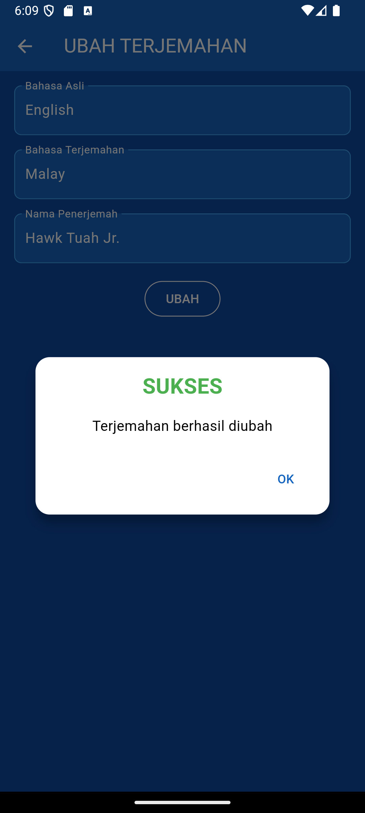

Pengguna akan melihat popup yang menginformasikan hasil perubahan terjemahan.

## Menghapus Terjemahan

### a. Memilih Produk untuk Dihapus

Dari halaman detail produk, pengguna dapat menekan tombol "DELETE" untuk menghapus terjemahan.

### b. Konfirmasi Penghapusan

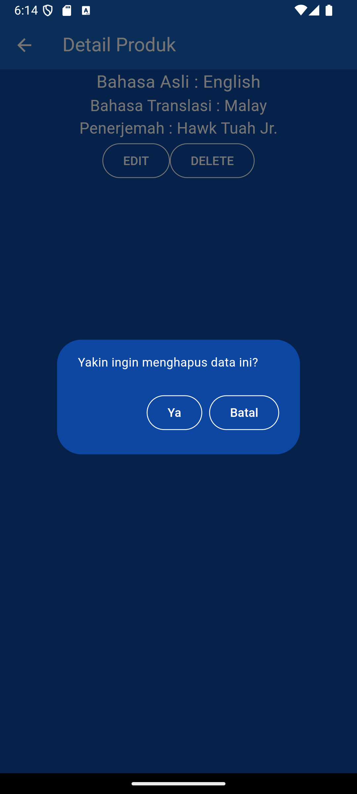

Sebelum menghapus, aplikasi akan menampilkan dialog konfirmasi.

Kode terkait:

```dart
void confirmHapus() {
  if (widget.produk?.id == null) {
    showDialog(
      context: context,
      builder: (BuildContext context) => const WarningDialog(
        description: "ID produk tidak ditemukan, tidak bisa menghapus.",
      ),
    );
    return;
  }

  AlertDialog alertDialog = AlertDialog(
    content: const Text("Yakin ingin menghapus data ini?"),
    actions: [
      OutlinedButton(
        child: const Text(
          "Ya",
          style: TextStyle(
              color: Colors.white
          ),
        ),
        onPressed: {//Logic tombol},
      ),
      OutlinedButton(
        child: const Text(
          "Batal",
          style: TextStyle(
              color: Colors.white
          ),
        ),
        onPressed: () => Navigator.pop(context),
      ),
    ],
  );
  showDialog(builder: (context) => alertDialog, context: context);
}
```

### c. Proses Penghapusan

Jika pengguna mengkonfirmasi, aplikasi akan mengirim permintaan hapus ke API.

Kode terkait:

```dart
onPressed: () async {
  bool success = await ProdukBloc.deleteProduk(
      id: int.parse(widget.produk!.id!));
  if (success) {
    showDialog(
      context: context,
      barrierDismissible: false,
      builder: (BuildContext context) => SuccessDialog(
        description: "Produk berhasil dihapus",
        okClick: () {
          Navigator.of(context).pushReplacement(
            MaterialPageRoute(
              builder: (context) => const ProdukPage(),
            ),
          );
        },
      ),
    );
  } else {
    // Jika penghapusan gagal
    showDialog(
      context: context,
      builder: (BuildContext context) => const WarningDialog(
        description: "Hapus gagal, silahkan coba lagi",
      ),
    );
  }
},
```

### d. Hasil Penghapusan Terjemahan

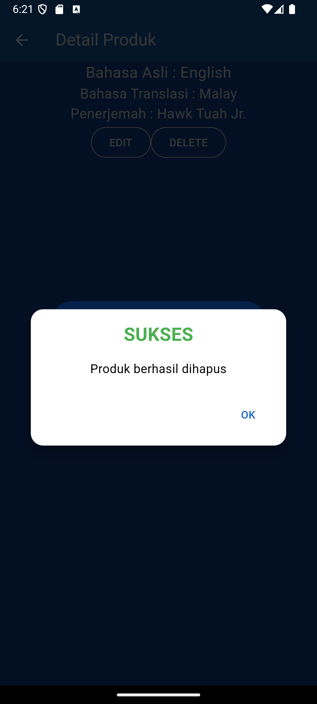

Pengguna akan melihat popup yang menginformasikan hasil penghapusan terjemahan.

## Proses Logout

### a. Memilih Menu Logout

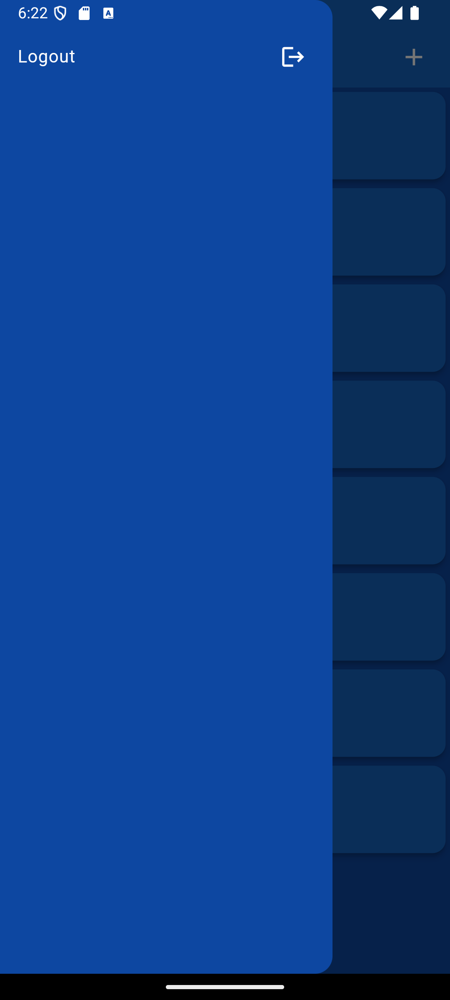

Pengguna dapat mengakses menu logout dari drawer aplikasi.

Kode terkait:

```dart
drawer: Drawer(
    child: ListView(
        children: [
            ListTile(
                title: const Text('Logout'),
                trailing: const Icon(Icons.logout),
                onTap: () async {
                    await LogoutBloc.logout().then((value) => {
                        Navigator.of(context).pushAndRemoveUntil(
                            MaterialPageRoute(builder: (context) => LoginPage()),
                            (route) => false)
                    });
                },
            )
        ],
    ),
),
```

### b. Proses Logout

Ketika pengguna memilih logout, aplikasi akan menghapus token dan informasi pengguna dari penyimpanan lokal.

Kode terkait:

```dart
class LogoutBloc {
  static Future logout() async {
    await UserInfo().logout();
  }
}

// Di dalam class UserInfo
Future logout() async {
  final SharedPreferences pref = await SharedPreferences.getInstance();
  pref.clear();
}
```

### c. Kembali ke Halaman Login

Setelah proses logout selesai, pengguna akan diarahkan kembali ke halaman login.